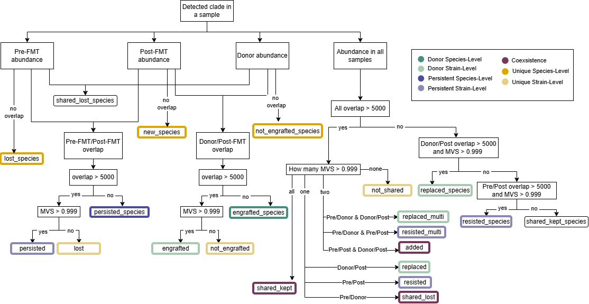

# SamestrGal: Command-Line Reproduction and Benchmarking

This repository contains the steps and commands required to run SamestrGal's tools from the 
command line, and to reproduce the benchmarking of SamestrGal against the SameStr Nextflow 
workflow. Additional files are provided to reproduce the taxonomic graphic in the thesis. 
Links to the datasets used in both workflows, as well as the results obtained, are also given.


## Repository Structure

```
.
├── scripts/
│   ├── nextflow_files/        # Corrected samestr.nf and params.yml for the Nextflow workflow
│   └── taxonomic_graphic/     # Script to reproduce the taxonomic graphic
└── terminal_commands/
    ├── testing_samestr_tools.sh   # Commands to run SameStr tools from the command line
    └── nextflow_workflow.sh       # Commands to run the SameStr Nextflow workflow
```

##  Replication of benchmarking


The links to the input datasets used for benchmarking can be found in nextflow_workflow.sh. These datasets can also be used for testing the individual tools in the command line. For this, the database downloads and command instructions can be found in testing_samestr_tools.sh.

For the benchmarking, run all datasets in Nextflow following the steps in nextflow_workflow.sh. It should take approx. 3-4h for each case. 
The most relevant files for the benchmarking will be in results/sstr_summarize/.

For SamestrGal, create 5 new histories, one for each case. The Galaxy histories from the thesis can be found here:


| Dataset | History |
|---|---|
| FRICKE Case 16 | [Galaxy History](https://usegalaxy.eu/u/xenia_m25/h/1) |
| FRICKE Case 19 | [Galaxy History](https://usegalaxy.eu/u/xenia_m25/h/19) |
| FRICKE Case 20 | [Galaxy History](https://usegalaxy.eu/u/xenia_m25/h/20-1) |
| FRICKE Case 28 | [Galaxy History](https://usegalaxy.eu/u/xenia_m25/h/28) |
| FRICKE Case 54 | [Galaxy History](https://usegalaxy.eu/u/xenia_m25/h/54-1) |

In order to compare the results generated by both workflows, the first file to check is results/sstr_summarize/taxon_counts.tsv and Taxon counts
in SamestrGal. From here, the amount of taxa detected by the workflow at each taxonomic rank in each sample can be compared. Then the actual shared taxa between samples can be analysed in the results/sstr_summarize/sstr_cooccurrences.tsv table in Nextflow and Strain co-occurrences dataset in SamestrGal. This table shows the shared taxa between all samples in the case. The relevant ones are the comparison between the Pre-FMT and Post-FMT sample, which shows the taxa the patient has kept from before the FMT treatment to after, and the comparison between Donor and Post-FMT sample, which shows the taxa that were engrafted from the healthy donor microbiota into the patient after FMT treatment was completed. This is a direct way of seeing how similarly the shared taxa were detected in both workflows. In order to see the exact clades that were detected as shared strains in the co-occurrences dataset, the file results/sstr_summarize/sstr_strain_events.tsv in Nextflow and Strain events in SamestrGal can be analysed. There the clades can be analysed one by one. The overlap and MVS score are also included, which can then help understand why a clade was detected as a shared strain in one workflow and not in the other. 

The Excel files containing the comparison of both workflows' results can be found in the following link:

https://doi.org/10.5281/zenodo.21630816

# Reproducing the Taxonomic Graphic from the SameStr publication

This graphic reuses the plotting notebook from the original SameStr publication's repository:

https://github.com/danielpodlesny/fmt_rcdi

## Steps

1. Clone the original repository:

   git clone https://github.com/danielpodlesny/fmt_rcdi.git

2. Download data.zip from the repository and take the files `microbe.taxonomy` and `samples.case_summary`:
   https://github.com/danielpodlesny/fmt_rcdi/blob/master/data.zip

3. Create new versions of these two files using the data obtained from this thesis's
   SamestrGal results. For the `samples.case_summary` the first column indicates whether the data is a Control sample or a rCDI sample.
  Copy the Control sample rows unchanged from the original file into the new samples.case_summary file. For the rest:

   - New `microbe.taxonomy`: created by joining all species with detected abundance for all 5 rCDI cases, which can be obtained from each sample's MetaPhlAn taxonomic profiles. In SamestrGal the dataset is called: Predicted taxon relative abundances. 

   - New `samples.case_summary`: the rCDI case rows are generated from several SamestrGal outputs. For each species-specific SNV profile detected in SameStr Convert for all samples of the five cases, a row has to be added along with metadata such as the sample name and the case it belongs to. The nucleotide coverage is also needed for all three FMT samples (Pre-FMT, Donor, and Post-FMT) and can be taken from the per-sample alignment statistics generated by SameStr Convert.The relative abundances also need to be added for each clade in each sample, These can be obtained from the MetaPhlAn taxonomic profile. For each row, the overlap and MVS values generated by each pairwise comparison that SameStr Compare generates also need to be added in different columns. 


| Study_Type | Study | Case_Name | Sample.recipient | Sample.post | Sample.donor | Days_Since_FMT.post | fmt_success | fmt_success.label | Pre-FMT/Donor.mvs | Pre-FMT/Post-FMT.mvs | Donor/Post-FMT.mvs | rel_abund.recipient | rel_abund.post | rel_abund.donor | event | source | analysis_level | species | n_covered.recipient | n_covered.post | n_covered.donor |
|---|---|---|---|---|---|---|---|---|---|---|---|---|---|---|---|---|---|---|---|---|---|
| rCDI | FRICKE | FRICKE_Case_20 | FRICKE_20A.pair | FRICKE_20E.pair | FRICKE_20B.pair | 84 | TRUE | Resolved | 0.993816473 | 0.987993564 | 0.999865852 | 0.023261 | 2.383998 | 3.04135 | engrafted | donor | strain | Agathobacter_rectalis | 8180 | 171969 | 172129 |

   Besides the data obtained from the results, an analysis level, a source and an event need to be added. The exact conditions that were used in the taxonomic graphic in SameStr were not stated. Based on all samples that were analysed, this is the logic that was abstracted from it:

   

   The nodes represent all possible events that can be added to a row based on certain conditions. For those events in green, the source is donor. For those in blue, the source is self. For those in yellow, the source is unique. For those in purple the source is both. There are also two events without a colour, those are source same_species, but the script doesn't take them into account when creating the figure. The analysis level can also be determined by the colours in the image.   


4. Place the new `microbe.taxonomy` and `samples.case_summary` files in fmt_rcdi/data/ to replace the originals.

5. Run the notebook that generates the figure:

   Rscript -e 'rmarkdown::render("notebooks/pub.Figure_5.Rmd")'

   The script used is the original pub.Figure_5.Rmd with two changed lines: lines 468 and 478 use filter(rCDI >= 5, Control >= 3) %>% instead
   of filter(rCDI >= 10, Control >= 5) to represent that less data was used in this analysis than to generate the original plot. The exact script used for SamestrGal can also be found in taxonomic_graphic/.

## Data Table Entries

The exact rows added for the rCDI cases with the data from SamestrGal used in the thesis to generate the plot can be found in the following link:

https://doi.org/10.5281/zenodo.21638741
